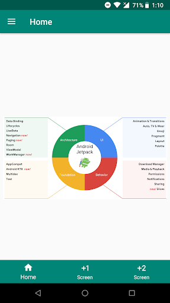
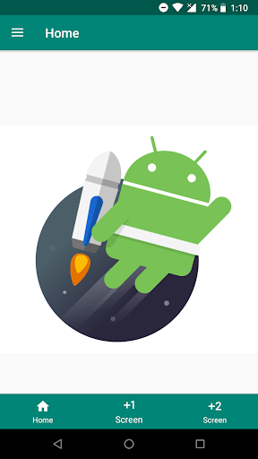
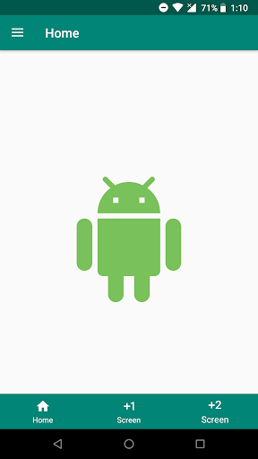
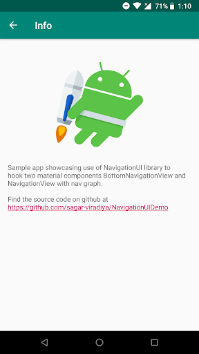
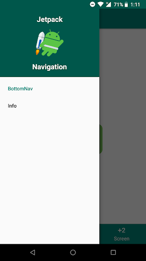

[](https://github.com/sagar-viradiya/NavigationUIDemo/blob/master/LICENSE) [](https://androidweekly.net/issues/issue-318)

# NavigationUIDemo
Sample app to demonstrate implementing navigation with [BottomNavigationView](https://developer.android.com/reference/android/support/design/widget/BottomNavigationView) and [NavigationView](https://developer.android.com/reference/android/support/design/widget/NavigationView) material components. App shows how to hook navigation graph with BottomNavigationView and NavigationView using [NavigationUI](https://developer.android.com/reference/androidx/navigation/ui/NavigationUI).

If you've found an error in this sample, please file an [issue](https://github.com/sagar-viradiya/NavigationUIDemo/issues). Patches are encouraged, just open PR.

# Screenshots






# License

```
Copyright 2018 Sagar Viradiya

Licensed under the Apache License, Version 2.0 (the "License");
you may not use this file except in compliance with the License.
You may obtain a copy of the License at

   http://www.apache.org/licenses/LICENSE-2.0

Unless required by applicable law or agreed to in writing, software
distributed under the License is distributed on an "AS IS" BASIS,
WITHOUT WARRANTIES OR CONDITIONS OF ANY KIND, either express or implied.
See the License for the specific language governing permissions and
limitations under the License.
```
